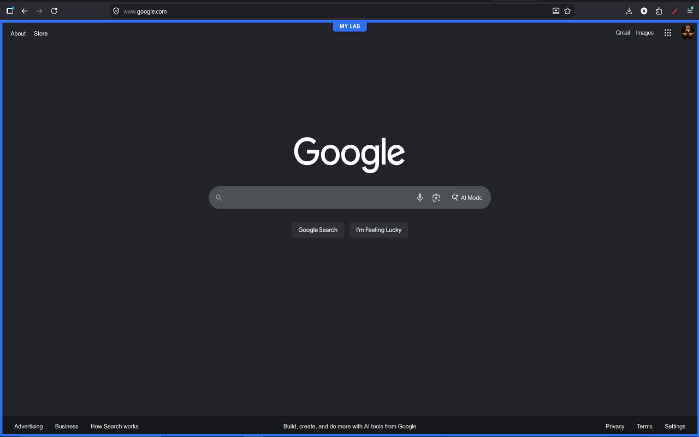
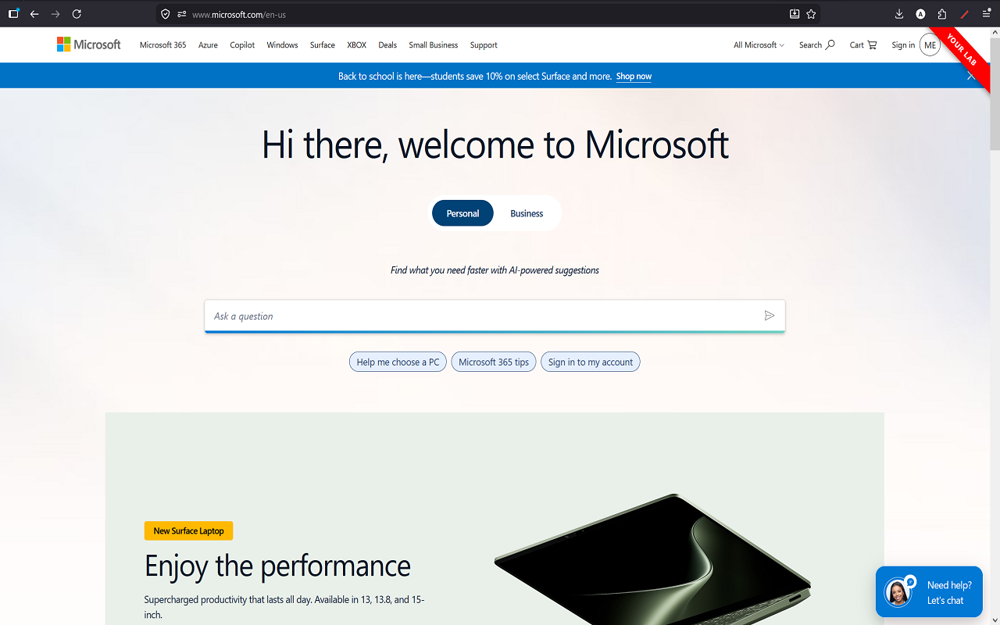
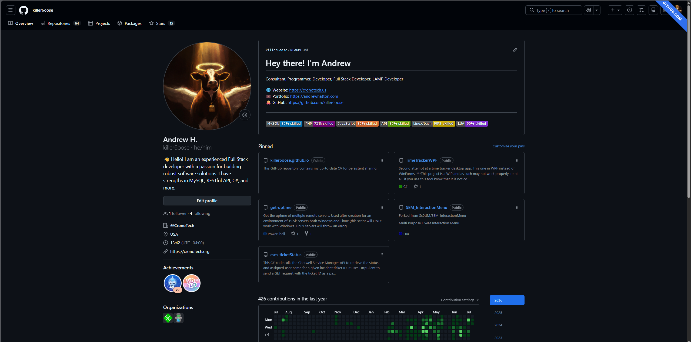
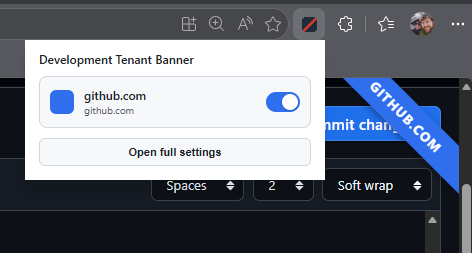
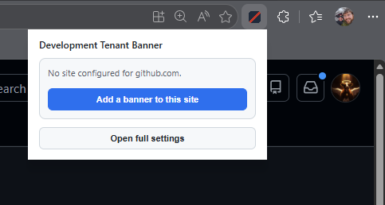
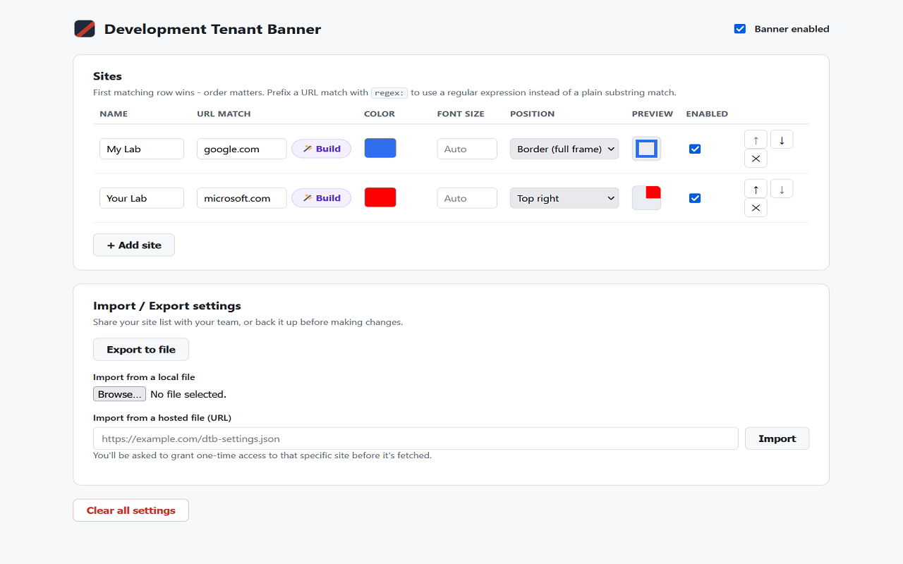

# Development Tenant Banner

A browser extension that draws a colored banner on the page so you always know which
environment a tab is pointed at: staging, UAT, production, or any custom tenant you
define. Built for anyone who moves between multiple environments during the day and
wants a hard-to-miss signal before making changes.

Works with any web-based platform or admin console, cloud-hosted or on-prem. You
define each environment yourself: a name, a URL match rule, a color, and where the
banner shows. Nothing is preset.

## Screenshots
### Banner examples

<table>
<tr>
<td></td>
<td></td>
<td></td>
</tr>
</table>

## Install

- **Download links to Edge, Chrome, and Firefox can be found at** https://cronotech.org/dtb/index.html

## How it works

Two settings surfaces:

- **Toolbar popup** - click the icon for a quick view of whether the current page
  matches a configured site, with a one-tap on/off toggle. If nothing matches, an
  "Add a banner to this site" button creates an entry for the current site on the
  spot, using the page's hostname as a starting point.
  <table>
    <tr>
      <td></td>
      <td></td>
    </tr>
  </table>
- **Full settings page** - opens in its own tab. This is where you manage the site
  list, colors, positions, and import/export.
  <table>
    <tr>
      <td></td>
    </tr>
  </table>

Each site in the list has:

- **Name** - your label for the entry.
- **URL match** - a snippet that must appear anywhere in the page URL (a plain
  case-insensitive substring check), or a full regex prefixed with `regex:`. A guided
  builder next to the field turns plain questions (exact domain, domain and
  subdomains, hostname prefix, any of several words, a wildcard pattern, or raw regex)
  into a working pattern without hand-writing one, with a live test against a sample
  URL before you commit to it.
- **Color** - picked from a small palette of readable colors. Banner text color
  (near-black or near-white) is chosen automatically based on the background so it
  stays legible without a separate setting to manage.
- **Font size** - `auto` by default, or any CSS size.
- **Position** - any corner as a diagonal ribbon, or a full-page border frame with a
  centered label.
- **Enabled** - turn a row on or off without deleting it.

Rows are checked top to bottom; the first enabled match wins, so more specific rules
should sit above broader ones. Reorder with the up/down arrows.

Settings export to a JSON file for backup or sharing a standard config with a team,
and import from either a local file or a URL you control (the browser asks for
one-time access to that specific origin, requested only when you import, not up
front).

## Privacy

No network requests, server component, or analytics are used. Settings are stored in the
browser's local extension storage on your own device and never leave it. Full policy:
https://cronotech.org/dtb/privacy.html

## Run from source

**Chrome / Edge**

1. Go to `chrome://extensions` (or `edge://extensions`).
2. Turn on Developer mode.
3. Click "Load unpacked" and select this folder.

**Firefox**

1. Go to `about:debugging#/runtime/this-firefox`.
2. Click "Load Temporary Add-on..." and select `manifest.json` in this folder.
   Temporary add-ons are removed on restart; a permanent install needs Mozilla
   signing or an enterprise policy.
